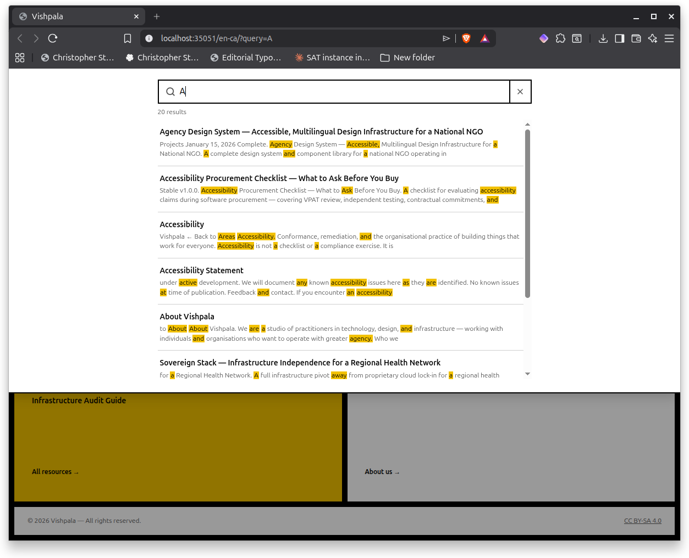

# Pagefind — Manual Installation on Ubuntu 26.04 LTS

Version: 0.1.4
Status: Draft
Style Guides: style-guide--technical-documentation-for-technologists-v0.2.0.md, web-ready-unrendered-markdown-using-apa-7-v0_2_2.md

## Abstract

Why this way? This is a way to avoid installing npm on your system and allows you to get a working pagefinder directly from the creators. This document is a production walkthrough for manually installing Pagefind on Linux/nix. It was tested on Ubuntu 26.04 LTS, following the same versioned binary pattern established by `hugo-tool`. It covers fetching the latest release version from the GitHub API, downloading the correct binary for the platform, verifying the download, installing into a versioned directory under `~/bin/pagefind-tool/`, and rendering a wrapper script at `~/bin/pagefind`. On completion, `pagefind` is available on `PATH` and can be invoked directly from any Hugo project build script.

## Sources and Acknowledgements

The Pagefind project is maintained by <a name="apa-pagefind-docs-citation"></a>[Pagefind (2025)](#apa-pagefind-docs-reference). Release assets and checksums are published to the <a name="apa-pagefind-releases-citation"></a>[Pagefind GitHub releases page (Pagefind, 2025)](#apa-pagefind-releases-reference). The versioned binary and wrapper pattern followed here is derived from the `hugo-tool` installer established for this workstation.

## 1. Prerequisites

`curl` and `jq` must be available on `PATH`. Verify:

```bash
curl --version | head -1
jq --version
```

`jq` is available in the Ubuntu 26.04 package repository if not already installed:

```bash
sudo apt install jq
```

The target directory `~/bin` must exist and be on `PATH`. This is already the case on this workstation from the `hugo-tool` setup.

## 2. Fetch the latest release version

The Pagefind project publishes releases to GitHub. The latest release tag is retrieved from the GitHub API:

```bash
cd ~/Downloads
LATEST_VERSION=$(curl -s https://api.github.com/repos/Pagefind/pagefind/releases/latest \
  | jq -r '.tag_name')
echo $LATEST_VERSION
```

Expected output example:

```text
v1.5.2
```

## 3. Download the binary

Pagefind publishes precompiled static binaries for each release. The Linux x86_64 binary is a `musl`-linked static executable with no runtime dependencies. Download it:

```bash
curl -LO \
  "https://github.com/Pagefind/pagefind/releases/download/${LATEST_VERSION}/pagefind-${LATEST_VERSION}-x86_64-unknown-linux-musl.tar.gz"
```

The available asset names for other platforms follow the same pattern:

| Platform | Asset name suffix |
|----------|------------------|
| Linux x86_64 | `x86_64-unknown-linux-musl.tar.gz` |
| Linux ARM64 | `aarch64-unknown-linux-musl.tar.gz` |
| macOS Intel | `x86_64-apple-darwin.tar.gz` |
| macOS Apple Silicon | `aarch64-apple-darwin.tar.gz` |

### 3.1 Verify the checksum

Pagefind publishes SHA-256 checksums alongside each release asset.

Download the checksum file:

```bash
curl -LO \
  "https://github.com/Pagefind/pagefind/releases/download/${LATEST_VERSION}/pagefind-${LATEST_VERSION}-x86_64-unknown-linux-musl.tar.gz.sha256"
```

Verify the checksum:

```bash
sha256sum --check "pagefind-${LATEST_VERSION}-x86_64-unknown-linux-musl.tar.gz.sha256"
```

Expected output:

```text
pagefind-v1.5.2-x86_64-unknown-linux-musl.tar.gz: OK
```

Do not proceed if the checksum fails.

## 4. Install into a versioned directory

Following the `hugo-tool` pattern, the binary is installed into a versioned subdirectory under `~/bin/pagefind-tool/`, not directly into `~/bin/`. This allows multiple versions to coexist and makes rollback straightforward.

Create the bin directory

```bash
mkdir -p ~/bin/pagefind-tool/${LATEST_VERSION}
```

untar to the bin dir

```bash
tar -xzf "pagefind-${LATEST_VERSION}-x86_64-unknown-linux-musl.tar.gz" \
  -C ~/bin/pagefind-tool/${LATEST_VERSION}/
```

Confirm:

```bash
ls -al ~/bin/pagefind-tool/${LATEST_VERSION}/
```


Expected output:

```text
total 9832
drwxrwxr-x 2 initial initial     4096 Jun 15 18:48 .
drwxrwxr-x 3 initial initial     4096 Jun 15 18:48 ..
-rwxr-xr-x 1 initial initial 10058288 Apr 12 08:35 pagefind
```

By default the tarred version of pagefind has the permissions above so currently, this is not required but may be in the future. We probably want to tighten permissions on server installations if this is ever required on a production system:

```bash
chmod +x ~/bin/pagefind-tool/${LATEST_VERSION}/pagefind
```

Verify that the binary runs:

```bash
~/bin/pagefind-tool/${LATEST_VERSION}/pagefind --version
```

Expected output:

```text
pagefind v1.5.1
```

The resulting directory structure at this point:

```bash
tree ~/bin/pagefind-tool/
```

output example:

```text
~/bin/pagefind-tool/
└── v1.5.1/
    └── pagefind
```

## 5. Creating the wrapper script

The wrapper at `~/bin/pagefind` delegates to the versioned binary. It follows the same pattern as the `hugo-tool` wrapper at `~/bin/hugo`:

```bash
cat > ~/bin/pagefind << EOF
#!/usr/bin/env bash
# pagefind — wrapper managed by pagefind-tool.
# Points to the currently active version. To update, rerun the installer
# and render a new wrapper pointing to the new version directory.
# Do not edit the rendered copy at ~/bin/pagefind by hand.
exec "\$HOME/bin/pagefind-tool/${LATEST_VERSION}/pagefind" "\$@"
EOF
chmod +x ~/bin/pagefind
```

## 6. Verify

Confirm the wrapper resolves correctly and the binary is functional:

```bash
which pagefind
pagefind --version
```

Expected output:

```text
/home/initial/bin/pagefind
pagefind v1.5.2
```

### 6.1 Prepare the project for git repository

In the git repository we will store our wrapper in scripts/nix. Then when a user clones the project they will not need to create the wrapper themselfes as we will have prepared wrappers for different openrating systems. So, for example scripts/windows-11/hugo would be the wrapper to be used on a windows system

```bash
mkdir -p ~/bin/pagefind-tool/scripts/nix
cp ~/bin/pagefind ~/bin/pagefind-tool/scripts/nix/.
```

## 7. Clean up

Remove the downloaded tarball and checksum file:

```bash
rm "pagefind-${LATEST_VERSION}-x86_64-unknown-linux-musl.tar.gz"
rm "pagefind-${LATEST_VERSION}-x86_64-unknown-linux-musl.tar.gz.sha256"
```

## 8. Usage in a Hugo project

Hugo Testing Project used to confirm the accuracy of this document:

```bash
cd /home/initial/Downloads/vishpala-v0.7.0
```

That said, this will work on a Hugo project (or any other project that you want to use pagefind in) can be anywhere on the (users) file system. 

With Pagefind on `PATH`, the build script at `scripts/build.sh` in any Hugo project can call it directly after running `hugo --minify`:

```bash
hugo --minify
```

Output example:

```bash
Start building sites … 
hugo v0.163.2-19a5cec0b9618163bb519487382e861d29edf383 linux/amd64 BuildDate=2026-06-15T14:55:00Z VendorInfo=gohugoio


                  │ EN - CA │ FR - CA 
──────────────────┼─────────┼─────────
 Pages            │      31 │      30 
 Paginator pages  │       0 │       0 
 Non-page files   │       0 │       0 
 Static files     │       1 │       1 
 Processed images │       0 │       0 
 Aliases          │       1 │       0 
 Cleaned          │       0 │       0 

Total in 60 ms
```


```bash
pagefind --site site
```

Expected output:

```text

Running Pagefind v1.5.2
Running from: "/home/initial/Downloads/vishpala-v0.7.0"
Source:       "site"
Output:       "site/pagefind"

[Walking source directory]
Found 45 files matching **/*.{html}

[Parsing files]
Did not find a data-pagefind-body element on the site.
↳ Indexing all <body> elements on the site.

[Reading languages]
Discovered 2 languages: en-ca, fr-ca

[Building search indexes]
Total: 
  Indexed 2 languages
  Indexed 44 pages
  Indexed 1791 words
  Indexed 0 filters
  Indexed 0 sorts

Finished in 0.034 seconds

```

Pagefind crawls the rendered HTML in the `site/` output directory, builds a chunked search index, and writes it to `site/pagefind/`. The index is served as static files alongside the rest of the site. Run the full build script to build the site and generate the index in a single step:

```bash
bash scripts/build.sh
```

Expected output:

```text
Building Hugo site...
Start building sites … 
hugo v0.163.1-2a4fd58818ffdf45bbb2a97ab119bb4c46cd93f0 linux/amd64 BuildDate=2026-06-11T15:34:40Z VendorInfo=gohugoio
                  │ EN - CA │ FR - CA 
──────────────────┼─────────┼─────────
 Pages            │      31 │      30 
 Paginator pages  │       0 │       0 
 Non-page files   │       0 │       0 
 Static files     │       1 │       1 
 Processed images │       0 │       0 
 Aliases          │       1 │       0 
 Cleaned          │       0 │       0 
Total in 54 ms
Running Pagefind indexer...
Running Pagefind v1.5.2
Running from: "/home/initial/Downloads/vishpala-v0.7.0"
Source:       "site"
Output:       "site/pagefind"
[Walking source directory]
Found 45 files matching **/*.{html}
[Parsing files]
Did not find a data-pagefind-body element on the site.
↳ Indexing all <body> elements on the site.
[Reading languages]
Discovered 2 languages: en-ca, fr-ca
[Building search indexes]
Total: 
  Indexed 2 languages
  Indexed 44 pages
  Indexed 1791 words
  Indexed 0 filters
  Indexed 0 sorts
Finished in 0.029 seconds
Done. Site built to site/ with search index at site/pagefind/
```

Next start the Hugo development server:

```bash
hugo server
```

Expected output:

```text
port 1313 already in use, attempting to use an available port
Watching for changes in /home/initial/Downloads/vishpala-v0.7.0/archetypes, /home/initial/Downloads/vishpala-v0.7.0/assets/css, /home/initial/Downloads/vishpala-v0.7.0/content/en-ca/{about,areas,projects,resources}, /home/initial/Downloads/vishpala-v0.7.0/content/fr-ca/{about,areas,projects,resources}, /home/initial/Downloads/vishpala-v0.7.0/i18n, /home/initial/Downloads/vishpala-v0.7.0/layouts/_default, /home/initial/Downloads/vishpala-v0.7.0/static/js
Watching for config changes in /home/initial/Downloads/vishpala-v0.7.0/hugo.toml
Start building sites … 
hugo v0.163.2-19a5cec0b9618163bb519487382e861d29edf383 linux/amd64 BuildDate=2026-06-15T14:55:00Z VendorInfo=gohugoio


                  │ EN - CA │ FR - CA 
──────────────────┼─────────┼─────────
 Pages            │      31 │      30 
 Paginator pages  │       0 │       0 
 Non-page files   │       0 │       0 
 Static files     │       1 │       1 
 Processed images │       0 │       0 
 Aliases          │       1 │       0 
 Cleaned          │       0 │       0 

Built in 49 ms
Environment: "development"
Serving pages from disk
Running in Fast Render Mode. For full rebuilds on change: hugo server --disableFastRender
Web Server is available at http://localhost:35051/ (bind address 127.0.0.1) 
Press Ctrl+C to stop
```

## Search Confirmation

This setup should give you **Incremental Search** results. You want to ensure that it does so.

### Incremental Search

Incremental Search has a lot of descriptions, here are some of the common ones all describing how this search should be working:

**Incremental Search** — Results update after each keystroke as the user types. Here are some other names for it:

**Live Search** — Similar term emphasizing real-time updates without pressing Enter.

**Search-as-you-type** — Common UX term used by products such as Google, Algolia, and Pagefind.

**Typeahead Search** — Often refers to showing matching results while typing, sometimes including suggestions.

**Autocomplete** — Suggests possible completions of the user's query rather than necessarily showing matching documents.

**Instant Search** — Marketing/UX term for immediate result updates.

### Confirming the Search 

Go to the URL and select the the search icon on the far right of the sites home page 


This should display the search dialog box as an element hovering over the websites header:


Start typing and you should almost instantly start seeing results, as you continue to type the results should be refined




Select an item and the page should be instantly displayed


## Resources

### Pagefind
- [Pagefind documentation](#apa-pagefind-docs-reference)
- [Pagefind releases](#apa-pagefind-releases-reference)

## References

<a name="apa-pagefind-docs-reference"></a>Pagefind. (2025). *Pagefind documentation*. Pagefind. https://pagefind.app/
[Return to citation](#apa-pagefind-docs-citation)

<a name="apa-pagefind-releases-reference"></a>Pagefind. (2025). *Pagefind releases*. GitHub. https://github.com/Pagefind/pagefind/releases
[Return to citation](#apa-pagefind-releases-citation)

## Changelog

| Version | Status | Notes |
|---------|--------|-------|
| 0.1.4 | Draft | Corrected repo owner to Pagefind throughout; corrected section 8 dev server description; corrected References |
| 0.1.2 | Draft | Version synchronisation |
| 0.1.1 | Draft | Working installation |
| 0.1.0 | Draft | Initial draft |
